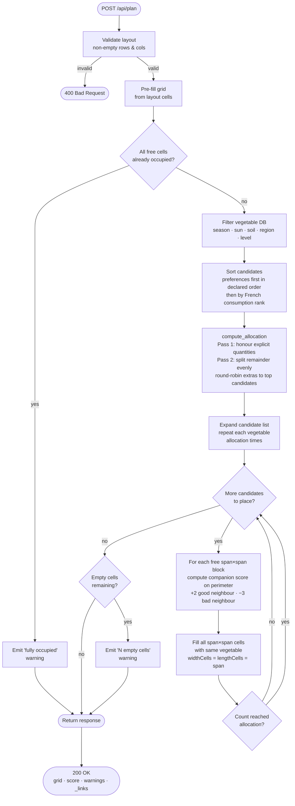

# Garden Planner API

A REST API written in Rust (Actix-web) that computes the optimal planting layout for a vegetable garden based on plot dimensions, season, sun exposure, soil type, region, skill level, companion planting rules, an existing layout, and non-plantable zones (paths, alleys, obstacles).

---

## Features

- **HATEOAS** — every response includes a `_links` object (HAL convention) with hyperlinks to related resources
- **Grid-based layout optimisation** — greedy placement algorithm that maximises companion planting scores (30 cm per cell)
- **Companion planting** — `+2` per good-companion neighbour, `−3` per bad-companion neighbour
- **~40 vegetables** in an in-memory catalogue with full metadata (seasons, soil types, sun exposure, region, spacing, days to harvest, lifecycle, companions, beginner-friendliness)
- **Blocked cells** — mark paths, alleys or obstacles as non-plantable; they are preserved in the response
- **Existing layout support** — pre-place vegetables before optimisation; conflicts with blocked zones emit warnings
- **Filtering** — by season, sun, soil, region and skill level (`Beginner` / `Expert`)
- **Preference ordering** — preferred vegetables (by id) are placed first
- **Warnings** — surfaced when constraints exclude all candidates or cells cannot be filled
- **Pure in-memory** — no database required

---

## Project Structure

```
src/
  lib.rs              # library crate root
  main.rs             # binary entry point — binds to 0.0.0.0:8080
  models/
    vegetable.rs      # Vegetable struct + enums: Season, SoilType, SunExposure, Region, Category, Lifecycle
    garden.rs         # GardenGrid, Cell (vegetable + blocked flag), PlacedVegetable
    request.rs        # PlanRequest, PlanResponse, PlannedCell, Level, CompanionsResponse, Link DTOs
  data/
    vegetables.rs     # in-memory vegetable database (~40 entries)
  logic/
    filter.rs         # filter by season / sun / soil / region / level, sort by preference
    companion.rs      # companion_score(), is_compatible()
    planner.rs        # plan_garden() — greedy grid placement
  api/
    handlers.rs       # HTTP handlers
    routes.rs         # Actix-web route configuration
tests/
  api_integration.rs  # HTTP integration tests (actix_web::test)
  planner_e2e.rs      # realistic end-to-end scenarios
bruno/
  bruno.json          # Bruno collection manifest
  environments/
    local.bru         # baseUrl: http://localhost:8080
  vegetables/         # Bruno requests for vegetable endpoints
  plan/               # Bruno requests for the plan endpoint
```

---

## API Endpoints

All responses include a top-level envelope with the following fields:

| Field | Description |
|---|---|
| `payload` | Domain data for this endpoint |
| `errors` | Array of error/warning strings (usually empty on success) |
| `_links` | HAL HATEOAS links — `href` + `method` per relation |

Endpoints that return a list use the **paginated envelope** which adds:

| Field | Description |
|---|---|
| `pagination.page` | Current page (1-based) |
| `pagination.perPage` | Items per page |
| `pagination.total` | Total number of items |
| `pagination.totalPages` | Total number of pages |

All responses include a `_links` object following the [HAL](https://stateless.co/hal_spec/hal_spec.html) convention. Each link has an `href` field and a `method` field indicating the HTTP method to use.

### `GET /api/vegetables`

Returns the full vegetable catalogue. Response is a paginated envelope where each item includes a `payload` object with the vegetable fields, plus per-item `_links.self` and `_links.companions`.

**Response:**
```json
{
  "payload": [
    {
      "payload": { "id": "tomato", "name": "Tomato", "..." },
      "errors": [],
      "_links": {
        "self":       { "href": "/api/vegetables/tomato",            "method": "GET" },
        "companions": { "href": "/api/vegetables/tomato/companions", "method": "GET" }
      }
    }
  ],
  "errors": [],
  "_links": { "self": { "href": "/api/vegetables", "method": "GET" } },
  "pagination": { "page": 1, "perPage": 42, "total": 42, "totalPages": 1 }
}
```

---

### `GET /api/vegetables/{id}`

Returns a single vegetable by id.

**Response:**
```json
{
  "payload": {
    "id": "tomato",
    "name": "Tomato"
  },
  "errors": [],
  "_links": {
    "self":       { "href": "/api/vegetables/tomato",             "method": "GET" },
    "companions": { "href": "/api/vegetables/tomato/companions", "method": "GET" },
    "collection": { "href": "/api/vegetables",                   "method": "GET" }
  }
}
```

Returns `404` with `{ "error": "..." }` when the id is unknown.

---

### `GET /api/vegetables/{id}/companions`

Returns the good and bad companions for a given vegetable id.

**Response:**
```json
{
  "payload": {
    "id": "tomato",
    "name": "Tomato",
    "good": [{ "id": "basil", "name": "Basil" }],
    "bad":  [{ "id": "fennel", "name": "Fennel" }]
  },
  "errors": [],
  "_links": {
    "self":      { "href": "/api/vegetables/tomato/companions", "method": "GET" },
    "vegetable": { "href": "/api/vegetables/tomato",           "method": "GET" }
  }
}
```

Returns `404` with `{ "error": "..." }` when the id is unknown.

---

### `POST /api/plan`

Computes the optimal garden layout.

**Request body:**
```json
{
  "season": "Summer",
  "sun": "FullSun",
  "soil": "Loamy",
  "region": "Temperate",
  "level": "Beginner",
  "preferences": [
    { "id": "tomato", "quantity": 3 },
    { "id": "basil" }
  ],
  "layout": [
    ["tomato", null,  null,  null,  null,  null,  null],
    [null,     null,  null,  null,  null,  null,  null],
    [true,     true,  true,  true,  true,  true,  true],
    [null,     null,  null,  null,  null,  null,  null]
  ]
}
```

Required fields: `season`, `layout`. All others are optional.

The `layout` field is a 2-D array that simultaneously defines grid dimensions and cell state:

| Cell value | Meaning |
|---|---|
| `null` | Free cell — plantable and empty |
| `"vegetable-id"` | Pre-placed vegetable (preserved in output) |
| `true` | Blocked cell — non-plantable zone (path, alley, obstacle) |

Grid dimensions are inferred directly from the array: `rows = layout.length`, `cols = layout[0].length`.

| Field | Type | Description |
|---|---|---|
| `season` | `Season` | Planting season |
| `layout` | `(string\|boolean\|null)[][]` | Grid encoding size, blocked zones, and pre-placed vegetables |
| `sun` | `SunExposure?` | Sun exposure filter |
| `soil` | `SoilType?` | Soil type filter |
| `region` | `Region?` | Climate region filter |
| `level` | `Level?` | Skill level filter |
| `preferences` | `{ id: string, quantity?: number }[]?` | Vegetables to prioritise; optional `quantity` sets the desired number of **plants** (placements) — each plant may occupy more than one cell |

**Enums:**

| Type | Values |
|---|---|
| `Season` | `Spring` `Summer` `Autumn` `Winter` |
| `SunExposure` | `FullSun` `PartialShade` `Shade` |
| `SoilType` | `Clay` `Sandy` `Loamy` `Chalky` `Humus` |
| `Region` | `Temperate` `Mediterranean` `Oceanic` `Continental` `Mountain` |
| `Lifecycle` | `Annual` `Biennial` `Perennial` |
| `Level` | `Beginner` `Expert` |

**Response:**
```json
{
  "payload": {
    "rows": 7,
    "cols": 10,
    "score": 14,
    "warnings": [],
    "grid": [
      [
        { "id": "tomato", "name": "Tomato", "reason": "...", "plantsPerCell": 1, "widthCells": 2, "lengthCells": 2, "blocked": false },
        { "coveredBy": { "row": 0, "col": 0 }, "blocked": false }
      ]
    ]
  },
  "errors": [],
  "_links": {
    "self":       { "href": "/api/plan",         "method": "POST" },
    "vegetables": { "href": "/api/vegetables",   "method": "GET" }
  }
}
```

Each `PlannedCell` carries:
- `id` / `name` / `reason` / `plantsPerCell` / `widthCells` / `lengthCells` — present **only on the anchor cell** (top-left of the block). `null` / omitted on continuation and empty cells.
- `coveredBy: { row, col }` — present **only on continuation cells** of a multi-cell block; points to the anchor cell (0-based row/col indices). Omitted on anchor and empty cells.
- `blocked` — `true` when the cell is a non-plantable zone

For a tomato (60 cm, span 2) placed at row 0, col 0 on a 4×4 grid:

| Cell | `id` | `widthCells` | `coveredBy` |
|---|---|---|---|
| [0][0] | `"tomato"` | `2` | — |
| [0][1] | — | — | `{row:0, col:0}` |
| [1][0] | — | — | `{row:0, col:0}` |
| [1][1] | — | — | `{row:0, col:0}` |

Returns `400` with `{ "error": "..." }` for an empty `layout` or malformed JSON.

---

## Placement Algorithm



1. **Validate** — `layout` must have at least one non-empty row; returns `400` otherwise.
2. **Pre-fill** — blocked cells (`true`) and pre-placed vegetables (`"id"`) are applied from the unified `layout` array. Unknown vegetable IDs emit a warning and are skipped.
3. **Early exit** — if every non-blocked cell is already occupied, return immediately with a warning.
4. **Filter** — the vegetable catalogue is narrowed by `season`, `sun`, `soil`, `region`, and `level`.
5. **Sort** — preferred vegetables appear first (in their declared order); remaining candidates are ordered by French household consumption rank (tomato → maïs); unknown IDs sort last.
6. **Allocate** — `compute_allocation` distributes the available cells:
   - *Pass 1*: explicit `quantity` preferences are honoured first — `quantity` is the number of **plants** (placements); multiplied by the plant's cell footprint (`span²`) to obtain cell consumption, then capped at remaining space.
   - *Pass 2*: leftover cells are split evenly; extra cells (modulo remainder) go to the highest-ranked candidates first.
7. **Place** — for each candidate slot, the algorithm finds the free `span × span` block that maximises `Σ(+2 per good neighbour) + Σ(-3 per bad neighbour)` on the block perimeter. Every cell in the block is filled with the same vegetable, `widthCells = span`, `lengthCells = span`. If no valid block exists for a multi-cell plant the candidate is skipped (remaining single-cell candidates can still fill gaps). Placement stops when the grid is full.
8. **Warn** — any remaining empty (non-blocked) cells produce an `"N empty cell(s)"` warning.
9. **Return** — the filled grid, cumulative companion score, warnings, and `_links`.

---

## Running Locally

```bash
# After cloning — activate the shared git hooks (one-time)
git config core.hooksPath .githooks

# Build & run
cargo run
# → server listening on http://localhost:8080

# Run all tests
cargo test
```

The pre-commit hook (`.githooks/pre-commit`) runs `cargo fmt --check`, `cargo build`, and `cargo test` before every commit and aborts on any failure.

---

## Bruno API Collection

The `bruno/` directory contains a [Bruno](https://www.usebruno.com/) collection covering all endpoints with assertions and Chai.js tests. It must always reflect the current state of the API.

```bash
# Run the collection headlessly (server must be running)
npx @usebruno/cli run bruno/ --env local
```
